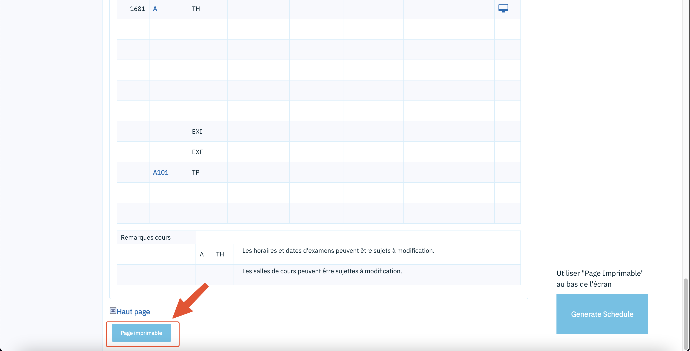

# Generateur d'horaire centre étudiant Université de Montreal

To generate your schedule install TamperMonkey and install the script then navigate here:

- [https://academique-dmz.synchro.umontreal.ca/psc/acprpr9/EMPLOYEE/SA/c/SA_LEARNER_SERVICES.SSR_SSENRL_LIST.GBL?Page=SSR_SSENRL_LIST&Action=A](https://academique-dmz.synchro.umontreal.ca/psc/acprpr9/EMPLOYEE/SA/c/SA_LEARNER_SERVICES.SSR_SSENRL_LIST.GBL?Page=SSR_SSENRL_LIST&Action=A)

- Click on the appropriate semester 
- **IMPORTANT** Scroll down to the end of the page and select *Page imprimable*

- Click on the button and the schedule should be generated

## Contribution

This script may need maintance, university of Montreal makes it difficult to maintain those tools due to poor design. Pull request are welcome.